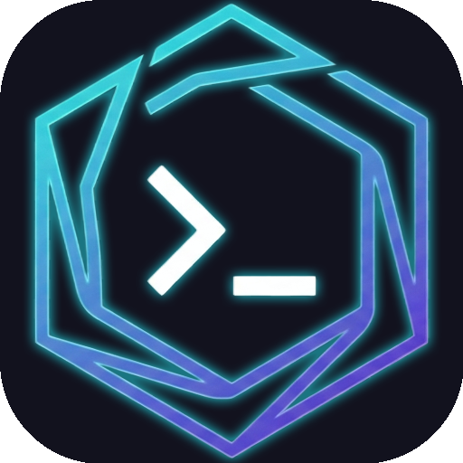

<p align="center">
  
</p>

<h1 align="center">MozzPCC</h1>
<p align="center">
  <strong>Personal Command Center</strong> — Tu dashboard personal, interactivo y moderno.
</p>

<p align="center">
  
  
  
  
  
  <br>
  
  
  
</p>

---

## Descripcion

MozzPCC es un dashboard personal disenado como centro de comando diario. Construido con HTML, CSS y JavaScript puro (sin frameworks), alojado en GitHub Pages y con persistencia en la nube gracias a Supabase. Pensado para tener todo lo que necesitas en un solo lugar: tareas, notas, finanzas, noticias y mucho mas.

**[Landing Page](https://mozzvader.github.io/MozzPCC/landing.html)** — Mirá la demo visual del proyecto.

## Funcionalidades

### Core

| Feature | Descripcion |
|---------|-------------|
| Autenticacion | Login/registro con email, Google OAuth, GitHub OAuth y Magic Link |
| Reloj y Saludo | Reloj digital en tiempo real con fecha en espanol y saludo personalizado |
| Relojes Mundiales | Multiples relojes de ciudades del mundo configurables |
| Cotizacion del Dolar | Cotizacion actualizada del dolar blue, oficial y mas (API dolarapi) |
| Lista de Tareas | CRUD completo con vista Lista o Kanban, persistencia en Supabase |
| Notas Rapidas | Notas adhesivas editables con 5 colores, Markdown basico, drag & drop y persistencia |
| Finanzas Personales | Transacciones con categorias, graficos (donut + barras + linea), comparacion mensual, export XLSX, privacidad |
| Ver Mas Tarde | Links guardados con tags de color, filtros y drag & drop |
| TV Shows | Series con agenda de proximos episodios y lista personalizada via TVmaze API |
| Noticias y Deportes | Feed de noticias RSS con fuentes configurables + resultados deportivos en tiempo real |
| Acceso Rapido | Links favoritos con iconos Font Awesome, imagen o favicon automatico |
| Backup/Restore | Exportar e importar todos tus datos en JSON |
| Clima | Temperatura actual via Open-Meteo (sin API key), ciudad configurable |

### Personalizacion

| Feature | Descripcion |
|---------|-------------|
| Temas del Dashboard | 6 skins: Dark Glass, Notion, Linear, macOS, Windows 11, Zai (Aurora Neural) |
| Paletas de Colores | 9 paletas: Cyber, Violet, Emerald, Rose, Amber, Twitter, Zai, macOS, Windows 11 |
| Wallpaper Personalizado | Imagen (URL) o color solido como fondo, independiente del tema |
| Moneda Configurable | Simbolo de moneda personalizable (ARS, USD, EUR, BRL, GBP, etc.) |

### UX / Accesibilidad

| Feature | Descripcion |
|---------|-------------|
| Command Palette | Busqueda rapida con Ctrl+K (secciones, links, tareas, notas, finanzas, acciones + busqueda web con /yt, /g, /w, /tw) |
| Keyboard Navigation | Numeros 1-8 para saltar a secciones, flechas/PgUp/PgDn para navegar, Home/End |
| Focus Trap | Tab cycling dentro de modales (accesibilidad) |
| Clean Mode | Vista limpia con solo reloj pulsando Esc (clic para volver) |
| Auto-lock | Clean Mode automatico por inactividad (configurable: 5-60 min o desactivado) |
| Indicador de Sync | Puntito verde que se enciende al guardar datos en Supabase |
| Undo Global | Toast de deshacer con barra de progreso al eliminar tareas, notas, transacciones, etc. (5s) |
| Snap Scroll | Navegacion vertical con snap sections e indicadores laterales con tooltips |
| Landing Page | Pagina de presentacion independiente con screenshots y efectos 3D |

## Diseno

- Tema oscuro con degradado profundo
- Tarjetas con efecto glassmorphism (vidrio esmerilado)
- Navegacion vertical con snap scroll e indicadores laterales
- 6 skins visuales (estructura + chrome) + 9 paletas de colores:

### Skins

| Skin | Estilo | Inspiracion |
|------|--------|------------|
| Dark Glass | Glassmorphism oscuro | Original PCC |
| Notion | Claro y minimalista | Notion |
| Linear | Dark minimalista | Linear App |
| macOS | Vibrancy, transparencia, traffic lights | macOS Sonoma |
| Windows 11 | Fluent Design, Acrylic, window controls | Windows 11 |
| Zai | Aurora neural, deep blue-black | Aurora Boreal |

### Paletas

| Paleta | Colores | Vibra |
|--------|---------|-------|
| Cyber | cyan + violet + green + sky | Futurista |
| Violet | purple + pink + blue | Futurista calido |
| Emerald | green + teal + blue | Matrix / nature |
| Rose | purple + violet + lavender | Bold y purpura |
| Amber | gold + orange + yellow | Calido y premium |
| Twitter | blue + dark blue + gray | Social / clean |
| Zai | violet + teal + pink | Aurora |
| macOS | cyan + purple + orange + green | Apple |
| Windows 11 | blue + teal + purple | Microsoft |

- Wallpaper personalizable (imagen o color solido)
- Diseno responsivo (escritorio, tablet y mobile)
- Tipografia moderna (Inter via Google Fonts, Segoe UI Variable en Windows 11)
- Iconos Font Awesome 6

## Estructura

```
MozzPCC/
├── index.html              # Pagina principal (dashboard + auth)
├── landing.html            # Landing page de presentacion
├── favicon.ico             # Favicon del sitio
├── assets/
│   └── logo.png            # Logo del proyecto
├── img/
│   ├── demo-scroll.webp    # Screenshot demo (secciones)
│   ├── demo-finanzas.webp  # Screenshot demo (finanzas)
│   └── demo-kanban.webp    # Screenshot demo (kanban)
├── css/
│   ├── styles.css          # Estilos completos
│   ├── palettes.css        # Paletas de colores
│   └── themes/
│       ├── default.css     # Tema Dark Glass (default)
│       ├── notion.css      # Tema Notion
│       ├── linear.css      # Tema Linear
│       ├── macos.css       # Tema macOS (Sonoma)
│       ├── windows.css     # Tema Windows 11 (Fluent Design)
│       └── zai.css         # Tema Zai (Aurora Neural)
├── js/
│   ├── utils.js            # Helpers compartidos (escapeHtml, timeAgo, focusTrap, iconos)
│   ├── supabase.js         # Cliente Supabase
│   ├── auth.js             # Sistema de autenticacion
│   ├── app.js              # Reloj, fecha, saludo, dots, keyboard navigation
│   ├── weather.js           # Widget de clima (Open-Meteo)
│   ├── dollar.js            # Cotizacion del dolar (dolarapi)
│   ├── worldClock.js        # Relojes mundiales
│   ├── quickAccess.js       # Accesos rapidos (favicon auto)
│   ├── tasks.js            # Lista de tareas (lista + kanban + undo)
│   ├── notes.js            # Notas adhesivas (Markdown + copiar + undo)
│   ├── finances.js         # Finanzas personales (transacciones + graficos + export)
│   ├── tvShows.js          # TV Shows con TVmaze API
│   ├── readLater.js        # Links guardados para leer mas tarde
│   ├── newsWidget.js       # Feed de noticias RSS
│   ├── sportsWidget.js     # Resultados deportivos
│   ├── githubWidget.js     # Widget de GitHub (repos + activity)
│   ├── commandPalette.js   # Command Palette (Ctrl+K + busqueda web)
│   ├── cleanMode.js        # Clean Mode + auto-lock por inactividad
│   ├── backup.js           # Backup/restore de datos
│   ├── undoToast.js        # Toast global de deshacer
│   ├── tips.js             # Tips y atajos (modal con focus trap)
│   └── settings.js         # Configuracion (temas, skins, paletas, wallpaper, moneda, accesos rapidos, auto-lock, countdown)
├── sql/
│   ├── schema.sql                        # Schema de BD + RLS (base)
│   ├── github_migration.sql              # Migration: github_username en user_preferences
│   ├── tasks_status_migration.sql         # Migration: status + sort_order en tasks
│   ├── tasks_priority_migration.sql       # Migration: priority en tasks
│   ├── read_later_migration.sql           # Migration: tabla read_later_items
│   ├── read_later_tag_migration.sql       # Migration: tag_color en read_later_items
│   ├── tv_shows_migration.sql             # Migration: tabla tv_shows
│   ├── steam_migration.sql               # Migration: tabla user_steam_settings
│   ├── theme_skin_migration.sql          # Migration: theme_skin en user_preferences
│   └── wallpaper_migration.sql            # Migration: wallpaper_url + wallpaper_color en user_preferences
├── supabase/
│   └── (Sin Edge Functions)
├── README.md               # Este archivo
└── SETUP.md                # Guia de configuracion paso a paso
```

## Configuracion Rapida

Queres tu propia instancia? Segui la [guia de configuracion completa](SETUP.md).

Resumen rapido:

1. Creá un proyecto en [Supabase](https://supabase.com)
2. Ejecutá `sql/schema.sql` en el SQL Editor
3. Ejecutá los SQL de migracion en orden (carpeta `sql/`)
4. Actualizá las credenciales en `js/supabase.js`
5. Configurá las Redirect URLs en Authentication
6. (Opcional) Activá Google/GitHub OAuth
7. Deployá en GitHub Pages

## Tecnologias

- HTML5 semantico
- CSS3 (Custom Properties, Grid, Glassmorphism)
- JavaScript ES6+ (vanilla, sin frameworks)
- Supabase (Auth + PostgreSQL + RLS)
- Chart.js 4 (graficos de dona y barras para finanzas)
- Google Fonts (Inter)
- Font Awesome 6

## Seguridad

- Row Level Security (RLS) en todas las tablas
- Cada usuario solo accede a sus propios datos
- Autenticacion gestionada por Supabase Auth
- La anon key es segura para uso en el frontend

## Licencia

Este proyecto esta licenciado bajo **Creative Commons Attribution-NonCommercial-NoDerivatives 4.0 International (CC BY-NC-ND 4.0)**.

Que significa esto en criollo:
- Atribucion: tenes que acreditar al autor original ([MozzVader](https://github.com/MozzVader)) si usas el codigo.
- No Comercial: no podes usar este proyecto para fines comerciales.
- Sin Derivadas: no podes crear proyectos derivados basados en este codigo.

Lee la licencia completa: [CC BY-NC-ND 4.0](https://creativecommons.org/licenses/by-nc-nd/4.0/legalcode)

---

<p align="center">
  
</p>
